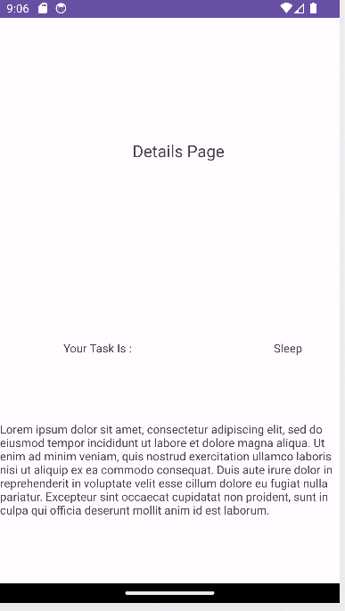
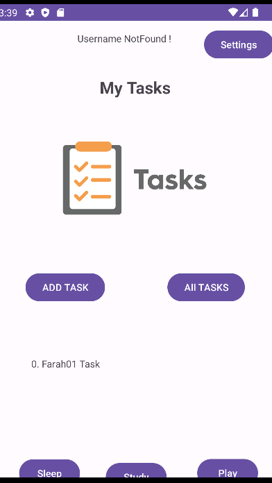

# taskmaster

on this lab i'm just working on basic of android, on .xml pages i'm just drag and drop for the view like button, textView, editText and so on
and on the java classes i'm just using Intent to move between the pages and using onClick to add action to spicefic button

- HOME

- Add Task 

- All Tasks 

# LAb02
on this lab i'm start using a Shared preferece to store some data and to rea data from shared prefernce
also i'm start dealing with pass data using Intent use a putExtra method and getExtra

# Lab03

on this lab i'm working on Create a Recycler View and how to make it tappable.

# Lab04
on this lab we start store a data in a database using room

# Lab: ClaSS31

on this task we start dealing with Espresso test,It's specifically designed for writing UI tests to ensure that the user interface of an Android app behaves correctly.

# Lab: Class32
on this lab i'm start working with DynamoDB, store and retrive the data from it .

