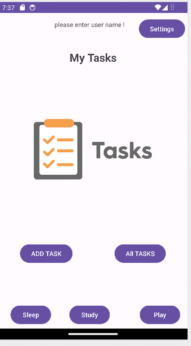
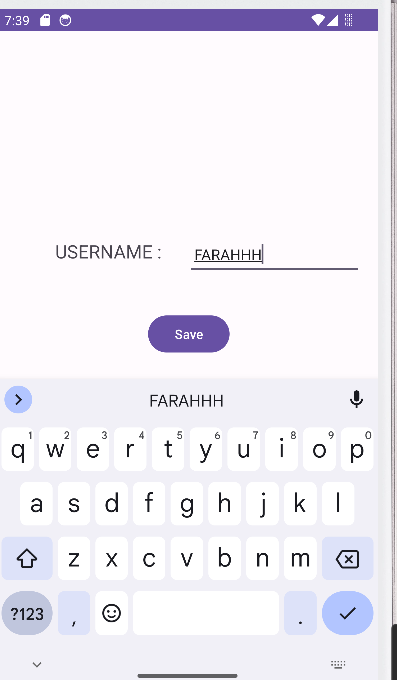
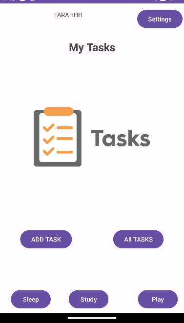

# LAb02
on this lab i'm start using a Shared preferece to store some data and to rea data from shared prefernce 
also i'm start dealing with pass data using Intent use a putExtra method and getExtra

